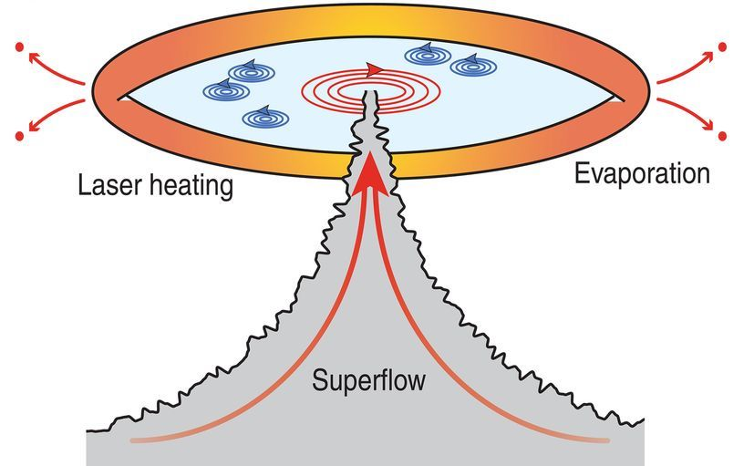
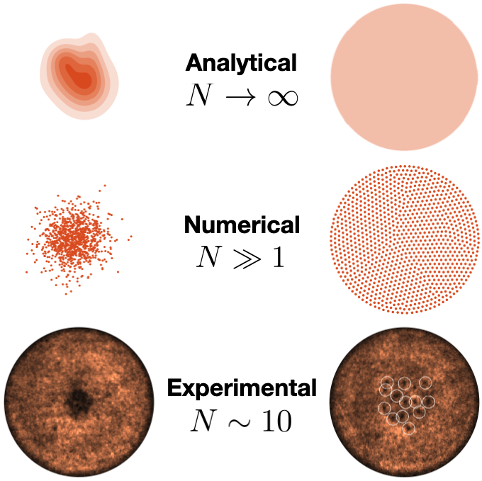

Superfluidity is a rich and unusual phenomenon that exhibits macroscopic quantum behaviour. Superfluids have *zero viscosity*, which means they can flow without loss of kinetic energy. This has very interesting and exiciting implications to future quantum technologies where this *dissipationless* property of superfluidity could be exploited to, for example, [build very low-energy electronic transistors](http://www.fleet.org.au).

However, superfluids can contain quantum vortices – tiny whirlpools that spin around and interact with one another (see the header figure). These vortices can be closely related to the emergence of dissipation in a superfluid. As such, we must study their dynamics to understand how we can predict their behaviour and even, perhaps, control it.

To study these vortices, we simulate their dynamics on a computer. Our starting point is the superfluid wave function, $\Psi(\mathbf{r},t)$, which describes the superfluid as a classic field. In the limit where the interactions between the superfluid atoms are weak, the dynamics follow the Gross-Pitaevskii equation

$$i\hbar\frac{\partial\Psi(\mathbf{r},t)}{\partial t} = \left\[-\frac{\hbar^2}{2m}\nabla^2+V(\mathbf{r})+g|\Psi(\mathbf{r},t)|^2\right]\Psi(\mathbf{r},t).$$

Here, $V(\mathbf{r})$ is the trapping potential of the superfluid, and $g$ describes the interactions between the superfluid atoms. By numerically solving the Gross-Pitaevskii equation, we can either directly simulate an experiment to confirm our observations, or gain further information about observations that cannot be directly acccessed in an experiment.

### Thin-film superfluid helium

For instance, in one project we worked closely with the [Queensland Quantum Optics Lab](http://www.physics.uq.edu.au/QOlab/index.html) to study the dynamics of vortices in thin-film superfluid helium. This experiment uses superfluids to perform optomechanical experiments to work towards building ultra-precise quantum sensors. 

In their experiment, vortices were present (see schematic below) and within the superfluid which led to some unexplained oberservations. Vortices in thin-film superfluid helium cannot be directly imaged, so we simulated their dynamics to gain insight into the experiment and understand their observations. As the Gross-Pitaevskii equation fails for superfluid helium, we used an approximate method called the *point vortex model* to simulate the vortex dynamics.

Our collaboration led to the first observation of coherent vortex dynamics in a strongly-interacting superfluid in quasi-two-dimensions. Our results can be found summarised [here](https://science.sciencemag.org/content/366/6472/1480?casa_token=wM3m7mt5wb0AAAAA:I5dlf4yfCKk-qqV5x2U9-Zcsif8Sh8QNpTEmNbE4Z1JfLY8iUhzJKe9pkX4wBXSczNjyLhjJwCu5rP56).

### Anomalous hydrodynamics

From these experiments, we began to observe some interesting properties about the dynamics of *chiral vortex clusters* (collections of same-sign vortices). We found that in a finite temperature superfluid, **all** distributions of chiral vortex clusters expanded to form a Rankine vortex.

We use a new theory that describes collections of vortices within the superfluid as a fluid in its own right. That is, the collection of vortices is thought of as a separate fluid and is goverened by its own Euler equation. In this Euler equation, however, there are additional terms that describe the quantum nature of the vortices giving rise to the name *anomalous hydrodynamics*. 

We found that this theory predicts the emergence of the Rankine vortex due to these anomalous terms. An analytical solution was found, which also described the Rankine vortex was a universal attractor solution. Whilst in classical fluids Rankine vortices are forbidden due to viscosity, they can be supported in superfluids.

Numerically simulating the dynamics of vortices within the point vortex model supported these results, as well as demonstrating further interesting physics such as scaling in the disorder decay and fractured lattice structure exhibiting short and long range correlations.

We found excellent agreement with an experiment observing the expansion of chiral vortex clusters. The [UQ BEC lab](https://bec.equs.org) created a vortex cluster in a Rubidium-87 Bose-Einstein condensate and observed its dynamics over a few seconds. The results demonstrated some key signatures of the anomalous hydrodynamic theory. A sample expansion of the vortex cluster in each of the three regimes can be seen below.

### Dynamics of vortex pinning